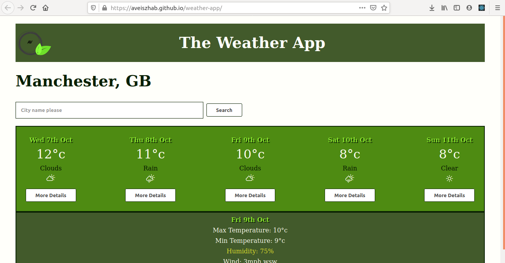

This is a course project part of the Manchester Codes curriculum.

# Weather app

The challenge was to build a 5 day weather forecasting app, based on a web API. 

## Learning objectives

* Can you explain what React is?
* Do you know the difference between JSX and HTML?
* Can you explain the difference between state and props?
* Can you test a component using React Testing Library?
* Do you know how events work and how to handle them?
* Can you make a request to a server and process the response data?
* Can you handle errors in JavaScript?
* Do you know how Hooks work compared to traditional lifecycle methods?

## Concepts

* React
* JSX
* Props
* State
* Container components
* Stateless (presentational) components
* React Testing Library
* Request/Response
* Error Handling
* Hooks

# Deployment
App was deployed on GitHub pages

https://aveiszhab.github.io/weather-app/

# Screenhots

# Development utilities used:

* The App was built using REACT
* Testing: Jest, React Testing Library
* Packages: Axios, PropTypes, Moments

# To run the App locally

* Fork and clone the repo:https://github.com/aveiszhab/weather-app

* Open the app on localhost:
npm start 

* Type in the location you are interested in. For weather details click on the more details button.

# Author:
Aniko Veiszhab

